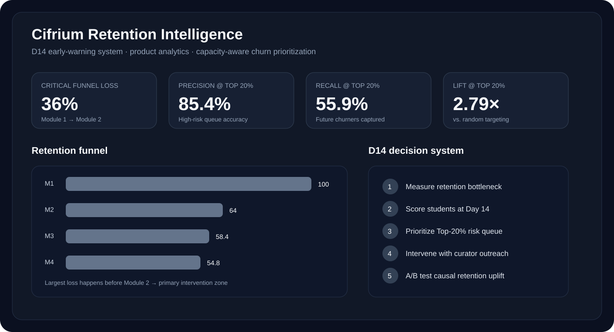
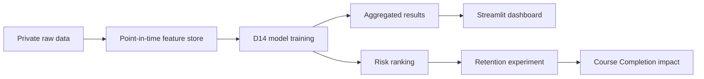

<div align="center">

# 🎓 Cifrium Retention Intelligence

### Early-warning system for student churn

**Product Analytics · Machine Learning · Experimentation · Streamlit**

<br>

| **36%** | **D14** | **85.4%** | **55.9%** | **2.79×** |
|:---:|:---:|:---:|:---:|:---:|
| M1→M2 loss | Prediction point | Precision@20% | Recall@20% | Lift@20% |

</div>



---

## Why this project exists

Cifrium is an online education platform with a four-module course. The largest retention loss happens immediately after the first module: **36% of students do not transition from Module 1 to Module 2**.

The business problem is therefore not simply to classify churn. It is to identify risk **early enough to intervene**, prioritize students under limited curator capacity, and measure whether the intervention creates real retention uplift.

> **North Star Metric:** Course Completion Rate  
> **Leading retention metric:** Module 1 → Module 2 Transition Rate  
> **Decision output:** D14 Churn Risk Score

```text
Early learning behavior
        ↓
D14 risk score
        ↓
Prioritized intervention
        ↓
M1 → M2 transition
        ↓
Course Completion Rate
```

---

## Executive summary

The final analytical sample contains **2,972 students** with a valid learning-start date. Headline performance is evaluated on a chronological future-cohort holdout of **615 students**.

The selected operating model is a **regularized Logistic Regression using D14 media + training behavior**.

| Metric | Result | Product meaning |
|---|---:|---|
| ROC-AUC | **0.917** | Strong overall ranking |
| PR-AUC | **0.815** | Strong performance under class imbalance |
| Brier Score | **0.113** | Reasonable probability quality |
| Precision@Top-20% | **85.4%** | Most students in the priority queue actually churn |
| Recall@Top-20% | **55.9%** | More than half of future churners are captured |
| Lift@Top-20% | **2.79×** | Queue is far richer in churn than random targeting |

### The key product result

If curators can contact only the **highest-risk 20%** of students, the model captures **55.9% of all future churners**.

That is the operating objective of the system—not maximizing a leaderboard metric in isolation.

---

## The most important analytical decision: what is “Day 14”?

Administrative enrollment is not the same as the start of learning.

The median gap between enrollment and the first scheduled lesson is approximately **26 days**. Anchoring D14 to enrollment would incorrectly label many students as inactive before their course had started.

The prediction clock is therefore reconstructed from the actual cohort schedule:

```text
stats.id параллели
        ↕
groups.group_template_id
        ↓
min(groups.starts_at)
        ↓
learning_start
        ↓
learning_start + 14 days = D14 cutoff
```

Every behavioral feature must satisfy:

```text
learning_start <= event_timestamp <= D14 cutoff
```

---

## Leakage-safe feature store

The project treats point-in-time correctness as a first-class requirement.

Final module progress, final assessment outcomes, whole-period aggregates, and any information created after the D14 cutoff are excluded from predictors.

### Training-specific leakage guard

A training can start before D14 but finish later. Therefore outcome-like training fields are only eligible when the corresponding outcome already existed by the cutoff:

```text
started_at <= D14
→ training start can be counted

finished_at <= D14
→ solved tasks / submitted answers / earned points can be used

mark_saved_at <= D14
→ mark can be used
```

This prevents the model from using future completion information disguised as an early feature.

---

## Data-source audit

A professional feature store is not built by adding every available table. Each source is evaluated for identity mapping, event time, leakage risk, and incremental decision value.

| Source | Decision | Role |
|---|---|---|
| `stats__module_1.csv` | ✅ Used | Population, cohort mapping, matured target |
| `groups.csv` | ✅ Used | Actual learning-start anchor |
| `wk_media_view_sessions.csv` | ✅ Used | D14 media engagement and learning cadence |
| `user_trainings.csv` | ✅ Used | D14 training/task behavior |
| `trainings.csv` | ✅ Used | Static training metadata |
| `users_courses.csv` | Audited | Safe timing features tested, not selected |
| `user_access_histories.csv` | Audited | Safe access timing tested, not selected |
| `user_activity_histories.csv` | Not selected | Requires scalable lesson→student mapping |
| `user_answers.csv` | Not selected | Very large event source; safer task signal already available |

---

## Feature-source ablation

Adding more sources improved some global metrics, but the product constraint is **Top-20% intervention capacity**.

| Feature set | ROC-AUC | PR-AUC | Precision@20% | Recall@20% | Lift@20% |
|---|---:|---:|---:|---:|---:|
| Media only | 0.913 | 0.806 | 80.5% | 52.7% | 2.63× |
| **Media + training** | **0.917** | **0.815** | **85.4%** | **55.9%** | **2.79×** |
| Media + course/access | 0.911 | 0.799 | 80.5% | 52.7% | 2.63× |
| All audited sources | 0.918 | 0.817 | 80.5% | 52.7% | 2.63× |

The “all sources” version is marginally stronger on global ROC-AUC / PR-AUC, but **media + training wins on the operational queue**.

That is why it is selected.

---

## What early churn looks like

The strongest product pattern is a **loss of learning cadence**, not one isolated event.

Future churners show:

- fewer active learning days;
- narrower content exposure;
- much lower media consumption;
- weaker continuation into week 2;
- longer inactivity by D14;
- fewer training starts;
- fewer safely completed training activities.

Example D14 differences:

| Behavior | Retained | Future churn |
|---|---:|---:|
| Media sessions | **9.58** | **1.69** |
| Active media days | **2.82** | **0.60** |
| Unique resources | **6.83** | **1.14** |
| Average watch depth | **46.8%** | **10.3%** |
| Recency at D14 | **4.43 days** | **11.22 days** |
| Maximum inactivity gap | **8.01 days** | **12.42 days** |

These are predictive associations. They are **not** interpreted as causal effects.

---

## Validation strategy

The headline result uses a **chronological future-cohort holdout**, not a random row split.

Expanding-window validation:

| Fold | Test churn | ROC-AUC | PR-AUC | Precision@20% | Recall@20% | Lift@20% |
|---|---:|---:|---:|---:|---:|---:|
| 1 | 18.6% | 0.848 | 0.503 | 50.4% | 54.2% | 2.71× |
| 2 | 67.1% | 0.919 | 0.954 | 99.2% | 29.7% | 1.48× |
| 3 | 30.6% | 0.917 | 0.815 | 85.4% | 55.9% | 2.79× |

The large change in churn prevalence is itself a product finding: **production monitoring must be cohort-aware**.

---

## Capacity-aware product decision

The model produces a ranked queue rather than a binary automated decision.

```text
High risk   → personal curator outreach
Medium risk → automated nudge / study-plan recommendation
Low risk    → standard learning journey
```

The threshold should follow real retention-team capacity.

At the recommended **Top-20%** operating point:

- Precision = **85.4%**
- Recall = **55.9%**
- Lift = **2.79×**

This translates model performance directly into an operational workload.

---

## Experimentation: prediction is not impact

The model identifies **who is at risk**. It does not prove that curator outreach reduces churn.

Eligible high-risk students should be randomized into:

| Group | Experience |
|---|---|
| Control | Business-as-usual |
| Treatment | Standardized curator outreach |

**Primary metric:** Module 1 → Module 2 Transition Rate  
**Secondary metric:** Course Completion Rate

Guardrails:

- curator workload;
- intervention cost;
- complaints / opt-outs;
- no deterioration in the standard learning experience.

```text
Incremental retained students
=
Eligible contacted students
×
Measured causal uplift
```

The model decides **who to prioritize**.  
The experiment decides **whether the intervention works**.

---

## Metrics framework

| Layer | Metric |
|---|---|
| North Star | Course Completion Rate |
| Leading retention metric | M1 → M2 Transition Rate |
| Ranking quality | PR-AUC |
| Operational targeting | Precision@Top-K, Recall@Top-K, Lift@Top-K |
| Behavioral diagnostics | Active days, recency, inactivity gap, week-2 continuation |
| Causal impact | Incremental transition-rate uplift |

---

## Public-safe architecture

Raw student-level data is intentionally excluded from the repository.



The public Streamlit app reads only aggregated outputs from `results/`.

No student-level data is required to review the portfolio or launch the dashboard.

---

## Repository structure

```text
cifrium-retention-intelligence/
├── README.md
├── app.py
├── requirements.txt
├── assets/
│   └── dashboard_preview.svg
├── data/
│   └── README.md
├── docs/
│   ├── BUSINESS_FINDINGS.md
│   ├── MODEL_REPORT.md
│   └── EXPERIMENT_DESIGN.md
├── notebooks/
│   └── 01_cifrium_early_churn_product_case.ipynb
├── results/
│   ├── model_metrics_extended.csv
│   ├── feature_source_ablation.csv
│   ├── temporal_validation_extended.csv
│   ├── behavioral_summary.csv
│   ├── capacity_curve.csv
│   └── source_audit.csv
└── src/
    └── features.py
```

---

## Run locally

### Portfolio dashboard

The dashboard requires only public-safe files committed to `results/`.

```bash
pip install -r requirements.txt
streamlit run app.py
```

### Full model reproduction

Full retraining additionally requires the private source files described in [`data/README.md`](data/README.md).

```bash
jupyter notebook notebooks/01_cifrium_early_churn_product_case.ipynb
```

---

## Project takeaway

This project treats churn prediction as a **product decision system**, not only as a classification task.

> **Measure → Predict → Prioritize → Intervene → Experiment → Learn**

The final objective is not the highest possible ROC-AUC.  
It is better retention and, ultimately, a higher **Course Completion Rate**.
